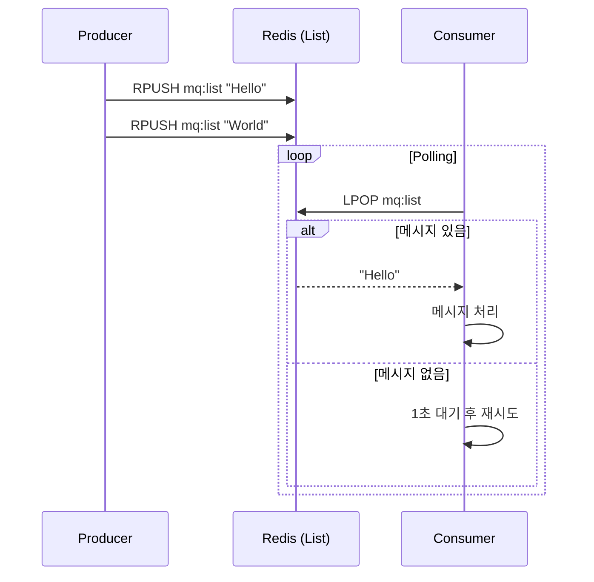

# Redis 기반 메시지 큐 구현 README

이 프로젝트는 Redis를 활용하여 메시지 큐(Message Queue)를 구현하는 두 가지 방식—**List 기반**과 **Stream 기반**—을 실습하고 정리한 내용입니다. 각 방식에 대해 C# (.NET) 기반으로 **Producer**와 **Consumer** 예제를 구현하며, 구조적인 흐름과 특징을 비교해가며 학습 목적에 맞춰 정리했습니다.

---

## 구현한 방식 요약

| 방식           | 특징                       | 병렬 처리      | 신뢰성 처리                | 사용 사례              |
| ------------ | ------------------------ | ---------- | --------------------- | ------------------ |
| Redis List   | 단순 FIFO 큐 (RPUSH + LPOP) | ❌ 직접 구현 필요 | ❌ 없음                  | 단일 Consumer 구조에 적합 |
| Redis Stream | 로그형 큐 + Consumer Group   | ✅ 가능       | ✅ Pending / ACK 기반 복구 | 분산 소비, 고신뢰 처리 요구   |

---

## 1. Redis List 기반 구현

### ✅ Producer

* 사용자 입력을 받아 `mq:list` 키에 `RPUSH` 방식으로 메시지 추가
* 메시지 개수 출력으로 상태 확인 가능

### ✅ Consumer

* `LPOP` 방식으로 왼쪽에서 메시지를 꺼내 소비
* 큐가 비어있을 경우 1초 간격으로 polling

### ✅ 흐름 요약



> 전체 구현 내용은 `Redis List Queue.md` 문서 참고

---

## 2. Redis Stream 기반 구현

### ✅ Producer

* `XADD` 명령으로 `mq:stream`에 메시지를 추가
* 각 메시지에는 Redis가 고유 ID(`timestamp-seq`)를 부여

### ✅ Consumer Group 구성

* `XGROUP CREATE`로 `mq-group` 생성 (한 번만 수행)
* 각 Consumer는 `XREADGROUP`을 사용해 그룹에 참여하고 메시지를 소비
* 처리 완료 후 `XACK` 호출로 메시지 확정

### ✅ 실패 복구 처리

* `XPENDING`으로 미확정 메시지 조회
* `XCLAIM`으로 일정 시간 이상 처리되지 않은 메시지를 다른 Consumer로 재전달 가능

### ✅ 흐름 요약

```mermaid
flowchart LR
  subgraph ProducerApp[Producer App]
    P[XADD mq:stream * message "<payload>"]
  end
  subgraph RedisServer[Redis Server]
    Stream[StreamKey: "mq:stream"]
    CG[Consumer Group: "mq-group"]
    PEL[PENDING LIST (PEL)]
    LastID[LastDeliveredID]
  end
  subgraph ConsumerA[Consumer A]
    A_Read[XREADGROUP GROUP mq-group A COUNT 1 BLOCK 5000 STREAMS mq:stream >]
    A_ACK[XACK mq:stream mq-group <messageId>]
  end
  subgraph ConsumerB[Consumer B]
    B_Read[XREADGROUP GROUP mq-group B COUNT 1 BLOCK 5000 STREAMS mq:stream >]
  end

  P -->|메시지 추가| Stream
  Stream -->|ID 생성| RedisServer

  RedisServer -->|배분| A_Read
  A_Read -->|PEL 등록| PEL & LastID
  A_Read --> ConsumerA

  ConsumerA -->|ACK| A_ACK
  A_ACK -->|PEL 제거| PEL

  RedisServer -.->|대기| B_Read
```

> 전체 구현 및 흐름 설명은 `Redis Stream Detailed.md` 문서 참고

---

## 실행 환경 및 설정

### Redis 설치 (Mac 기준)

```bash
brew install redis
brew services start redis
```

또는 Docker 실행:

```bash
docker run -d -p 6379:6379 redis
```

### .NET 프로젝트에서 StackExchange.Redis 설치

```bash
dotnet add package StackExchange.Redis
```